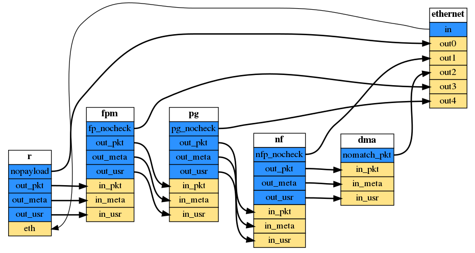

# Pigasus 2.0

Pigasus is an Intrusion Detection and Prevention System (IDS/IPS) that achieves 100Gbps using a single FPGA-equipped server. Pigasus' FPGA-first design ensures that most packets are processed entirely using the FPGA, while some packets are sent to the CPU for full evaluation. Refer to the [OSDI '20 paper](https://www.usenix.org/conference/osdi20/presentation/zhao-zhipeng) and [Zhipeng Zhao's PhD Thesis](http://users.ece.cmu.edu/~jhoe/distribution/2021/zhao.pdf) for details about the design.  You can view a [presentation by Zhipeng](https://www.youtube.com/watch?v=iQcxaiXwMuo) on the [Crossroads YouTube Channel](https://www.youtube.com/channel/UCGXVSHxK6PZKFiP9-XtjxtA).

Compared to Pigasus 1.0, Pigasus 2.0 enables easy customization and more efficient scaling of the Pigasus design. For more details, please refer to the [Pigasus_Release](pigasus_release.md).

If you want to run Pigasus as it is, without customization, please go to `./pigasus` directly. 

## Customize Pigasus
Instructions for customizing Pigasus 2.0 (what most users should need) are available in the comments of `pigasus.py`. After modifying that file run `run_pigasus.sh` to regenerate the Pigasus 2.0 RTL code in `./pigasus` with modifications. Similarly, to customize multi-FPGA Pigasus 2.0 edit `pigasus_multi.py` and then run `run_pigasus_multi.sh` to regenerate the multi-FPGA Pigasus RTL code in `./pigasus_multi` with modifications. There is also a [tutorial](https://cmu.zoom.us/rec/share/phaNWivBKek6Aa9VQZf5idY6GdNnmNjFIszumVyPUOfRMU2Q4ano3M1Lr0qsGKeZ.K4thwzhu0Uq3sGgM).

Directory organization
* `run_pigasus.sh`: driver script for generating Pigasus. This is what most users should need.
* `run_pigasus_multi.sh`: driver script for generating multi-FPGA Pigasus.
* `pigasus`: contains the RTL code for single-FPGA Pigasus' modules. See [Pigasus README](pigasus/README.md) for RTL simulation instructions.
* `pigasus_multi`: contains the RTL code for multi-FPGA Pigasus' modules. See [Pigasus Multi README](pigasus_multi/README.md) for RTL simulation instructions.
* `pigasus.py`: front end to drive Fluid for constructing Pigasus 2.0 designs. The comments in this file mention how to customize Pigasus 2.0 by editing this file.
* `pigasus_multi.py`: front end to drive Fluid for constructing multi-FPGA Pigasus 2.0 designs. The structure of this file is similar to `pigasus.py`, therefore the documentation is the same and is only present in `pigasus.py`.
* `fluid`: contains a minimal version of Fluid for constructing Pigasus 2.0 designs. See [Fluid README](fluid/README.md) for more information.
* `top_base.sv`, `top0_base.sv`, `top1_base.sv`: helper SystemVerilog code for generating new Pigasus 2.0 designs.

## License

Pigasus is developed at Carnegie Mellon University. The software component (`pigasus/software`) is adapted from Snort3 and released under the [GNU General Public License v2.0](pigasus/software/LICENSE). The rest of the components including (`pigasus/hardware`,`pigasus_multi_fpga`,`fluid`) are released under the [BSD 3-Clause Clear License](pigasus/hardware/LICENSE). 
