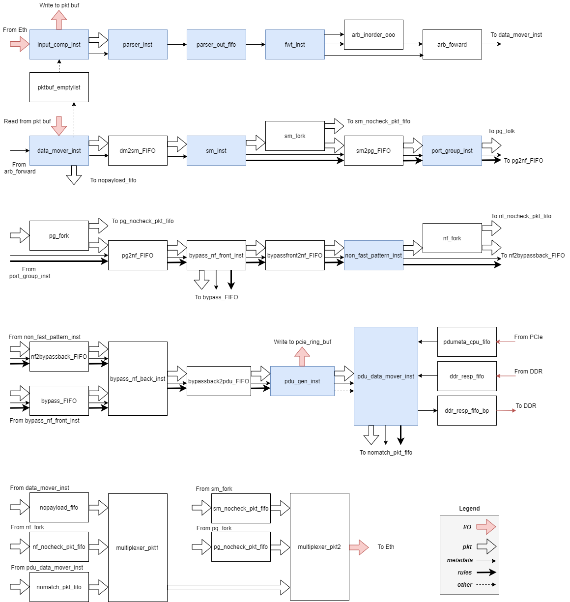

# Pigasus Hardware Components
Below shows the top level (top.sv) block diagram. It is chopped in order to fit. Please read it from left to right, and from up to bottom. Please refer to the legend for the type of signal. For simplicity, the backpressure is not explicitly drew in the diagram. 

## File description:
- `hw_test`: Script for hardware on-board tests.
- `input_gen`: Converts `.pcap` files to `.pkt`, which can be used as input for the RTL simulation. Each line represents a "flit" -- the minimum data unit that can be processed in one cycle on the FPGA. Each flit has 512 bits and one packet consists of a variable number of flits, e.g., a 128-byte packet has 2 flits, while a 256-byte packet has 4 flits. For more information, please refer to [Intel Avalon Streaming Interfaces](https://www.intel.com/content/dam/www/programmable/us/en/pdfs/literature/manual/mnl_avalon_spec.pdf). It also contains the example pcap and expected simulation results of that pcap. 
- `run_vsim.sh`: Script for running simulation in Modelsim, which requires the path to simulation library of Quartus. You can select the GUI mode or command-line mode by toggling last two lines.

The source code is under `src`. 
- `common`: Common building block like FIFOs, DSPs, MUXes. All the code here are generated by Quartus IPs. All the code outside this directory are handed-coded. 
- `common_usr`: Common building block that shared by multiple Pigasus components. 
- `memory_init`: The initialization files of the multi-string pattern matcher (fast_pattern_matcher + port_group + non_fast_pattern_matcher).
- `mux`: This is only usefuly when go across FPGAs.

- `buffer`: Packet buffer mangement. 
- `parser`: Packet parser that extract the metadata from raw Ethernet packet data.
- `reassembly`: It is responsible for (a) keeping track of TCP pkt flow context(e.g. seq number, etc) using a 4-way Cuckoo Hash Tables with a stash and (b) reorder the out-of-order pkts using a linked-list.
- `fast_pattern_matcher`: Fast pattern matcher code template. It is composed of frontend and backend. The frontend includes the shiftOR filter(first_filter.sv) and 1-bit hashtable filter (hashtable_top.sv). The backend is the rule reduction logic that selects the valid rules from wide rule vector issued by the frontend and generates narrow rule vector for Port Group by using a tree of 2-1 reduction unit (reduction_2t1.sv). 
- `port_group`: Take the suspicious pkts and potential rules identified by fast_pattern_matcher. Compare the pkt header with rule header to further filter out innocent pkts. 
- `non_fast_pattern_matcher`: Take the suspicious pkts and potential rules identified by port_group. Compare the pkt payload with all of the non-fast string patterns of the potential rules to further filter out innocent pkts.
- `pcie`: Takes the suspicious pkts and potential rules identified by non_fast_pattern_matcher. Generate DMA request to CPU. Mange the FPGA-side and CPU-side ring buffer. This module is not fully exercised in RTL simulation. The testbench fakes the PCIe response such that no pkts are matched eventually.  

- `struct_s.sv`: The header file that specifies most of the parameters and structs. 
- `tb.sv`: The testbench. It reads the input `.pkt` files and then drive the system by sending the flits cycle-by-cycle. It also provides different clocks for the design-under-test to match up with hardware clock frequency. When the test finishes, it displays the status registers to mimic the JTAG port used in the hardware test. 
- `stats.sv`: FPGA side performance monitor. It filters out the ARP packets (users have to change `src_mac_filter`).
- `top.sv`: The top level module with core logic. Various counters are used to monitor the correctness/performance bottlenecks of the datapath. 

## Add new counters:
1. Change `NUM_REG` and add new counter name in `states_reg.sv`. Assume the new counter is called "new", the newly added parameter should be "REG_NEW". 
2. In `top.sv`, change the following places. (1) Create three signals, "new", "new_status", "new_r1"; (2) Create logic that updates the counter "new"; (3) Cross the clock domain to "clk_status" domain using double-flop, which works as the counter stays stable at the end of the experiment; (4) Add new case statement in JTAG register reading logic.
3. To read the new counter in RTL simulation, change the case statement in `tb.sv` correspondingly. 
4. To read the new counter in hardware onboard test using JTAG, change `stats.tcl` in `pigasus_pr/hw_test/hwtest`. Create new counter name by `set REG_NEW X`, where the "X" is the same value in `states_reg.sv`. Change "proc get_top_stats" by following previous counter examples. 
